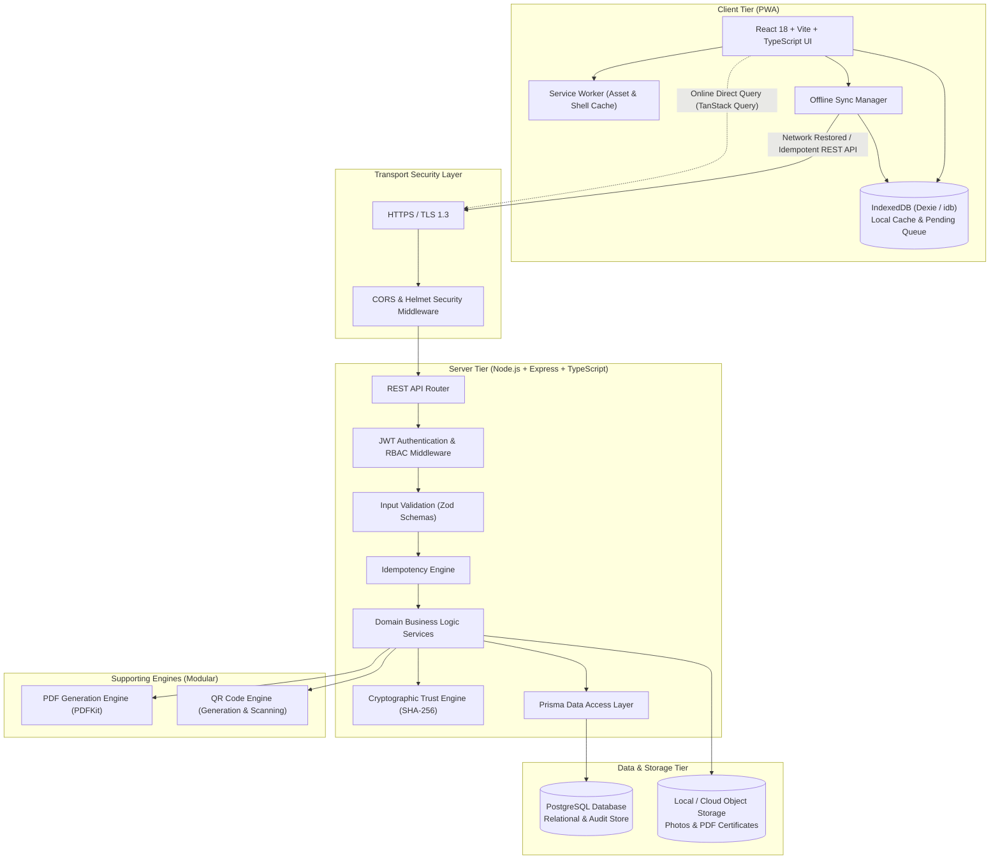

# Servora — System Architecture Document (SAD)

**Document Version:** 1.0.0  
**Status:** Frozen / Baseline for Phase 1  
**Project Name:** Servora  
**Repository:** `https://github.com/mitali-salhotra10/Servora.git`  

---

## 1. Architectural Overview & Design Principles

Servora is architected as an **Offline-First, Tiered Web Application** centered on trust and data integrity. Because safety technicians routinely inspect equipment in cellular dead-zones (sub-basements, enclosed stairwells, remote industrial tanks), the system architecture decouples local field execution from cloud data persistence.

### Key Architectural Principles:
1. **Offline-First as a Primary Path:** The client is designed with the assumption that network connectivity is an intermittent luxury, not a prerequisite.
2. **The Servora Trust Chain:** Every completed inspection generates an immutable, tamper-evident cryptographic trail from check-in to public certificate verification.
3. **Strict Layered Separation of Concerns:** Both frontend and backend maintain clear architectural boundaries between transport, business logic, data access, and storage.
4. **Stateless API & Horizontally Scalable Backend:** All authentication state is self-contained in JWT tokens, ensuring the Express backend can scale horizontally without session stickiness.

---

## 2. High-Level Architecture Diagram



---

## 3. The Servora Trust Chain Architecture

The defining differentiator of Servora is the cryptographic chain of custody established during a service visit. The platform transforms subjective, disputable field work into verifiable digital proof:

```mermaid
sequenceDiagram
    autonumber
    actor Customer
    actor Tech as Field Technician
    participant PWA as Servora PWA (Client)
    participant IDB as IndexedDB (Offline)
    participant API as Express REST API
    participant DB as PostgreSQL (Prisma)
    participant OBJ as Object Storage
    actor Auditor as Public Auditor / Inspector

    Customer->>API: Create Service Request / Contract
    API->>DB: Persist Contract & Generate VisitSchedule
    Note over Tech,PWA: Technician opens app online; downloads daily manifest
    API->>PWA: Cache Site & Checklist Data
    PWA->>IDB: Store Local Manifest

    Note over Tech,PWA: Technician enters basement (OFFLINE)
    Tech->>PWA: Geofenced Check-in (GPS captured)
    Tech->>PWA: Scan Equipment QR Code & Execute Checklist
    Tech->>PWA: Capture Photo Evidence (Compressed Blobs)
    Tech->>Customer: Present Device for Customer Signature
    Customer->>PWA: On-screen Customer Signature
    Tech->>PWA: Finalize Visit
    PWA->>IDB: Enqueue in PendingSyncQueue (UUID IdempotencyKey)

    Note over Tech,PWA: Technician returns to truck (ONLINE)
    PWA->>API: POST /api/sync/visits (Payload + IdempotencyKey)
    API->>API: Authenticate JWT & Validate RBAC
    API->>DB: Check IdempotencyKey in Database
    Note over API,DB: Key not found: Commit VisitRecord & Attachments
    API->>API: Compute Canonical SHA-256 Record Hash
    API->>OBJ: Save Photos & Rendered PDF Certificate
    API->>DB: Save VisitRecord (Status: COMPLETED, Hash: SHA-256)
    API-->>PWA: HTTP 200 OK (ACK + Certificate Reference)
    PWA->>IDB: Mark Queued Item Synced / Purge Blob Cache

    Note over Auditor,API: Fire Marshall scans QR Code on physical certificate
    Auditor->>API: GET /verify/:certificateId (Public, No Login)
    API->>DB: Fetch VisitRecord & Verify SHA-256 Hash
    API-->>Auditor: Return Masked Verification Status (VALID / EXPIRED)
```

---

## 4. Offline-First Architecture & Synchronization Protocol

### 4.1 State 1: Online Mode (Standard Connected Operation)
When reliable network connectivity is active:
- Read queries (customer profiles, upcoming schedules, provider listings) are fetched directly using **TanStack React Query** and cached in memory and IndexedDB.
- Write actions by managers or customers (creating service requests, updating profiles) are dispatched directly over HTTPS to the Express REST API.

```text
[React PWA UI] ──(HTTPS)──> [Express API] ──> [Business Services] ──> [Prisma] ──> [PostgreSQL]
```

### 4.2 State 2: Offline Mode (Field Inspection Disconnected)
When the technician loses cellular connectivity in the field:
- The PWA detects offline state via `window.navigator.onLine === false` or API failure.
- The UI seamlessly switches to local persistence:
  1. Check-in coordinates, timestamp, and device GPS accuracy are saved into IndexedDB.
  2. Checklist answers and numerical measurements are written to IndexedDB.
  3. Captured photos are downsampled, converted to binary blobs, and stored in IndexedDB.
  4. Vector signature paths are serialized to SVG/Base64 and stored in IndexedDB.
  5. The entire completed inspection package is stamped with a client-generated UUID (`idempotencyKey`) and placed into the `pendingSyncQueue`.

```text
[React PWA UI] ──> [IndexedDB] ──> [Local Visit Record] ──> [Pending Sync Queue]
```

### 4.3 State 3: Reconnection & Idempotent Synchronization
When network connectivity is re-established:
1. **Network Event Detection:** The PWA's `SyncManager` is notified by `window.addEventListener('online')` or periodic heartbeat pings.
2. **Sequential Queue Processing:** The `SyncManager` reads the oldest unsynced item from `pendingSyncQueue` to preserve causal ordering.
3. **API Dispatch:** Dispatches a structured sync envelope to `POST /api/sync/visits` carrying the payload and the unique `idempotencyKey`.
4. **Server Verification Pipeline:**
   - **Authentication:** Verifies the bearer JWT token.
   - **Authorization:** Confirms the technician is assigned to the visit.
   - **Idempotency Gate:** Queries `SELECT id FROM "VisitRecord" WHERE "idempotencyKey" = :key`.
     - *Case A (New submission):* Inserts the visit record, responses, and attachments in a single PostgreSQL transaction, calculates the SHA-256 hash, generates the certificate, and returns `HTTP 201 Created`.
     - *Case B (Already committed - replay after network drop):* Bypasses insertion, retrieves the existing `VisitRecord` and returns `HTTP 200 OK` with the existing certificate details.
5. **Acknowledgment (ACK) & Local Cleanup:**
   - Upon receiving HTTP 200/201 from the server, the `SyncManager` flags the local queue item as `SYNCED` and purges large binary image blobs from IndexedDB to free client storage.

```text
[Pending Queue] ──> [Sync Manager] ──> [Express API]
                                            ↓
                                  [JWT Authentication]
                                            ↓
                                  [RBAC Authorization]
                                            ↓
                                [Idempotency Key Check]
                                            ↓
                                  [PostgreSQL Commit]
                                            ↓
                           [ACK (HTTP 200/201) to Client]
                                            ↓
                                [Mark Synced in IndexedDB]
```

---

## 5. Client-Side Architectural Layers (Frontend PWA)

```text
client/
├── public/                 # PWA Manifest, App Icons, Offline Fallback Shell
└── src/
    ├── app/                # Application root, routing provider, global providers
    ├── assets/             # Static graphics and icons
    ├── components/         # Shared presentation components (Buttons, Modals, Cards)
    │   ├── ui/             # Primitive UI components (Tailwind CSS styled)
    │   └── layout/         # Header, Navigation, Role-based Sidebar
    ├── features/           # Domain-driven feature slices
    │   ├── auth/           # Login, registration, token storage
    │   ├── customers/      # Customer site & equipment components
    │   ├── providers/      # Provider profile and service catalogs
    │   ├── contracts/      # AMC creation, overview, and compliance view
    │   ├── scheduling/     # Calendar, upcoming/overdue visit manifests
    │   ├── technician/     # Mobile inspection forms, checklist, camera, signature
    │   ├── verification/   # Public certificate verification view
    │   └── dashboard/      # Role-specific dashboard widgets
    ├── hooks/              # Custom React hooks (useNetworkStatus, useGeolocation, useAuth)
    ├── lib/                # Third-party configurations (Axios instance, QueryClient)
    ├── offline/            # Offline engine
    │   ├── db.ts           # IndexedDB schema and Dexie/idb configuration
    │   ├── syncManager.ts  # Queue orchestrator, retry logic, event listeners
    │   └── storage.ts      # Binary blob and cache helpers
    ├── services/           # Typed API service clients (Axios requests)
    ├── types/              # Global TypeScript interfaces and domain types
    └── utils/              # Formatting, geofence calculation, date math
```

---

## 6. Server-Side Architectural Layers (Backend REST API)

```text
server/
└── src/
    ├── config/             # Environment variables, database connection, constants
    ├── controllers/        # HTTP route handlers (request parsing, status codes)
    │   ├── auth.controller.ts
    │   ├── customer.controller.ts
    │   ├── provider.controller.ts
    │   ├── contract.controller.ts
    │   ├── visit.controller.ts
    │   ├── sync.controller.ts
    │   └── certificate.controller.ts
    ├── middlewares/        # Express pipeline middlewares
    │   ├── auth.middleware.ts        # JWT verification
    │   ├── rbac.middleware.ts        # Role permission checking
    │   ├── validate.middleware.ts    # Zod schema validation
    │   ├── error.middleware.ts       # Centralized error formatting
    │   └── audit.middleware.ts       # AuditEvent logger
    ├── services/           # Pure business logic and domain operations
    │   ├── auth.service.ts
    │   ├── scheduling.service.ts     # Automated recurring visit generation
    │   ├── inspection.service.ts     # Checklist validation and scoring
    │   ├── trust.service.ts          # SHA-256 hash generation and verification
    │   ├── certificate.service.ts    # PDF rendering and QR stamping
    │   └── sync.service.ts           # Idempotency checks and batch processing
    ├── repositories/       # Data persistence wrappers (Prisma Client queries)
    ├── utils/              # Crypto utilities, PDF generators, coordinate math
    ├── types/              # Express request augmentation and backend DTOs
    └── app.ts              # Express application assembly and middleware binding
```

---

## 7. Supporting & External Services Integration Strategy

1. **Object Storage Service:**
   - Photographs captured in the field and generated PDF certificates are abstracted behind a unified storage interface (`IStorageService`).
   - For local development and semester evaluation, files are stored on a local filesystem directory with secured static serving (`/uploads/...`).
   - The architecture allows zero-code switching to Amazon S3, MinIO, or Google Cloud Storage in production by changing an environment variable (`STORAGE_PROVIDER=local|s3`).
2. **PDF Certificate Generation Engine:**
   - Server-side headless rendering using `PDFKit` or `Puppeteer`.
   - Generates vector-sharp certificates containing formal safety declarations, serial numbers, technician license details, customer signature graphics, and the verification QR code.
3. **QR Code Engine:**
   - Server generates standard PNG/SVG QR codes (`qrcode` library) encoding the public verification URL.
   - Client PWA leverages HTML5 camera scanning (`html5-qrcode` or BarcodeDetector API) to scan physical tags without third-party native apps.
4. **External Messaging Services (Deferred for MVP):**
   - Notification architecture is modularized through an event dispatcher (`NotificationService`).
   - For the initial MVP, notifications are persisted to the database (`NotificationLog`) and displayed in the in-app notification center.
   - SMS/WhatsApp gateways (e.g., Twilio, Gupshup) are isolated behind mock adapters until needed.
