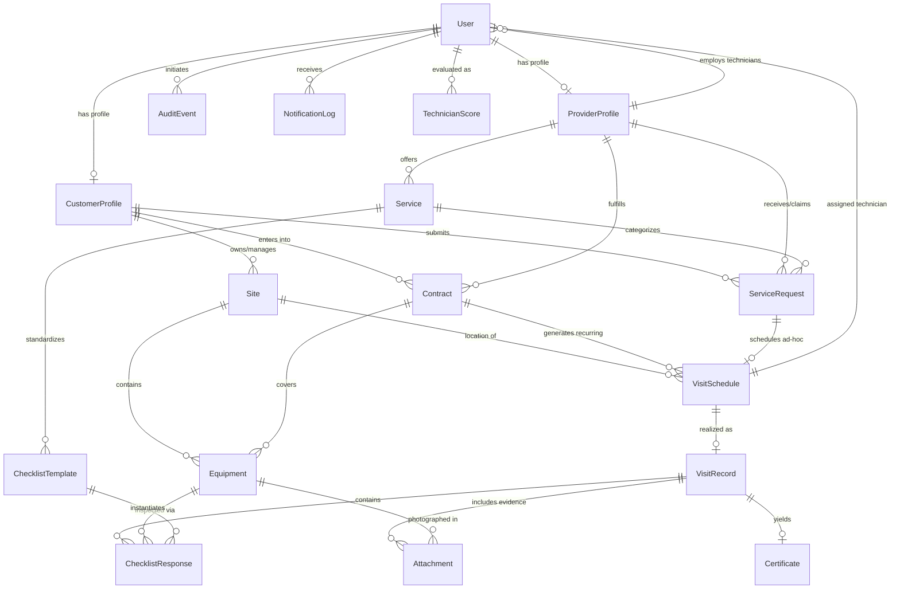

# Servora — Conceptual Data Model Specification

**Document Version:** 1.0.0  
**Status:** Frozen / Baseline for Phase 1  
**Project Name:** Servora  
**Repository:** `https://github.com/mitali-salhotra10/Servora.git`  
**Notice:** *This document specifies the conceptual data model and relational architecture only. Prisma schema code will be generated in a subsequent phase.*

---

## 1. Data Architecture Principles

1. **Relational Consistency (ACID):** Every service interaction, asset inspection, contract term, and compliance certificate requires strict referential integrity. Foreign keys and cascade/restrict rules protect against orphaned compliance records.
2. **Immutability of Historical Proof:** Entities representing executed field services (`VisitRecord`, `ChecklistResponse`, `Attachment`, `Certificate`, `AuditEvent`) are append-only. Once marked completed and hashed, they cannot be updated or deleted.
3. **Idempotency by Design:** All offline synchronization entities maintain unique client-generated UUID keys to prevent duplicate creation on retry.

---

## 2. Entity-Relationship (ER) Conceptual Diagram

---

## 3. Detailed Entity Catalog (17 Core Entities)

### 3.1 User
- **Purpose:** Central authentication identity and access authority for all platform participants.
- **Key Attributes:**
  - `id` (UUID, Primary Key)
  - `email` (String, Unique, Indexed)
  - `passwordHash` (String, bcrypt hash)
  - `phone` (String, Optional)
  - `role` (Enum: `CUSTOMER`, `SERVICE_PROVIDER`, `SERVICE_MANAGER`, `ADMIN`)
  - `isActive` (Boolean, Default: True)
  - `createdAt`, `updatedAt` (Timestamps)
- **Relationships:**
  - 1-to-0..1 with `CustomerProfile` (if role = CUSTOMER)
  - 1-to-0..1 with `ProviderProfile` (if role = SERVICE_PROVIDER / SERVICE_MANAGER)
  - 1-to-Many with `VisitSchedule` (as assigned technician)
  - 1-to-Many with `AuditEvent`, `NotificationLog`, `TechnicianScore`

### 3.2 CustomerProfile
- **Purpose:** Stores business entity, commercial billing metadata, and operational contact details for clients requesting safety maintenance.
- **Key Attributes:**
  - `id` (UUID, Primary Key)
  - `userId` (UUID, Foreign Key → User, Unique)
  - `companyName` (String, Optional for residential)
  - `contactPersonName` (String)
  - `taxId` / `gstin` (String, Optional)
  - `billingAddress` (Text)
  - `createdAt`, `updatedAt` (Timestamps)
- **Relationships:**
  - 1-to-1 with `User`
  - 1-to-Many with `Site` (a customer can manage multiple facilities/branches)
  - 1-to-Many with `Contract` and `ServiceRequest`

### 3.3 ProviderProfile
- **Purpose:** Represents the service provider entity—either an independent technician or a small contractor business.
- **Key Attributes:**
  - `id` (UUID, Primary Key)
  - `userId` (UUID, Foreign Key → User, Unique)
  - `businessName` (String)
  - `licenseNumber` (String, Fire safety certification number)
  - `verificationStatus` (Enum: `PENDING_VERIFICATION`, `VERIFIED`, `SUSPENDED`)
  - `serviceRadiusKm` (Integer, Operational coverage distance)
  - `baseLatitude`, `baseLongitude` (Decimal, Workshop/office coordinates)
  - `averageRating` (Decimal, 1.00 to 5.00)
  - `totalCompletedVisits` (Integer, Default: 0)
  - `createdAt`, `updatedAt` (Timestamps)
- **Relationships:**
  - 1-to-1 with `User`
  - 1-to-Many with `Service` (catalog of services offered)
  - 1-to-Many with `Contract` (contracts serviced)
  - 1-to-Many with `ServiceRequest`

### 3.4 Service
- **Purpose:** Defines standardized service offerings across the fire-safety domain (e.g., Extinguisher Refilling, Annual Hydrant Testing).
- **Key Attributes:**
  - `id` (UUID, Primary Key)
  - `providerId` (UUID, Foreign Key → ProviderProfile)
  - `name` (String, e.g., "CO2 Fire Extinguisher 4.5kg Refill & Test")
  - `domainCategory` (Enum: `FIRE_EXTINGUISHER`, `FIRE_HYDRANT`, `FIRE_ALARM`, `GENERAL_SAFETY`)
  - `description` (Text)
  - `basePrice` (Decimal, Optional reference rate)
  - `estimatedDurationMinutes` (Integer)
  - `isActive` (Boolean)
- **Relationships:**
  - Many-to-1 with `ProviderProfile`
  - 1-to-Many with `ServiceRequest`
  - 1-to-Many with `ChecklistTemplate` (standardized inspection items)

### 3.5 ServiceRequest
- **Purpose:** Manages the initial lifecycle of an ad-hoc or customer-initiated service booking from request through acceptance.
- **Key Attributes:**
  - `id` (UUID, Primary Key)
  - `customerId` (UUID, Foreign Key → CustomerProfile)
  - `providerId` (UUID, Foreign Key → ProviderProfile, Nullable if broadcast)
  - `siteId` (UUID, Foreign Key → Site)
  - `serviceId` (UUID, Foreign Key → Service)
  - `status` (Enum: `SUBMITTED`, `ACCEPTED`, `REJECTED`, `SCHEDULED`, `COMPLETED`, `CANCELLED`)
  - `preferredDate` (Date)
  - `preferredTimeSlot` (String, e.g., "09:00 - 12:00")
  - `customerNotes` (Text)
  - `rejectionReason` (Text, Nullable)
  - `createdAt`, `updatedAt` (Timestamps)
- **Relationships:**
  - Many-to-1 with `CustomerProfile`, `ProviderProfile`, `Site`, `Service`
  - 1-to-0..1 with `VisitSchedule` (when accepted and scheduled)

### 3.6 Site
- **Purpose:** Physical premises, building, or plant location where fire-safety assets reside and field visits take place.
- **Key Attributes:**
  - `id` (UUID, Primary Key)
  - `customerId` (UUID, Foreign Key → CustomerProfile)
  - `siteName` (String, e.g., "Logistics Warehouse South Gate")
  - `address` (Text)
  - `city`, `postalCode` (String)
  - `latitude`, `longitude` (Decimal, GPS location for geofencing)
  - `geofenceRadiusMeters` (Integer, Default: 100)
  - `onSiteContactName`, `onSiteContactPhone` (String)
  - `createdAt`, `updatedAt` (Timestamps)
- **Relationships:**
  - Many-to-1 with `CustomerProfile`
  - 1-to-Many with `Equipment` (assets registered at this site)
  - 1-to-Many with `VisitSchedule`

### 3.7 Contract
- **Purpose:** Governs recurring maintenance agreements (e.g., Annual Maintenance Contract - AMC, Quarterly Maintenance Contract - QMC) between a customer and a service provider.
- **Key Attributes:**
  - `id` (UUID, Primary Key)
  - `contractNumber` (String, Unique, e.g., "AMC-2026-0042")
  - `customerId` (UUID, Foreign Key → CustomerProfile)
  - `providerId` (UUID, Foreign Key → ProviderProfile)
  - `siteId` (UUID, Foreign Key → Site)
  - `frequency` (Enum: `MONTHLY`, `QUARTERLY`, `BI_ANNUAL`, `ANNUAL`)
  - `startDate`, `endDate` (Dates)
  - `gracePeriodDays` (Integer, e.g., 7 days past scheduled date before overdue)
  - `status` (Enum: `DRAFT`, `ACTIVE`, `SUSPENDED`, `EXPIRED`, `TERMINATED`)
  - `termsSummary` (Text)
  - `createdAt`, `updatedAt` (Timestamps)
- **Relationships:**
  - Many-to-1 with `CustomerProfile`, `ProviderProfile`, `Site`
  - 1-to-Many with `VisitSchedule` (automatically generated recurring visits)
  - Many-to-Many with `Equipment` (equipment items covered by this contract)

### 3.8 Equipment
- **Purpose:** Individual safety hardware asset tracked under compliance (fire extinguisher, hydrant point, alarm panel, smoke detector).
- **Key Attributes:**
  - `id` (UUID, Primary Key)
  - `siteId` (UUID, Foreign Key → Site)
  - `serialNumber` (String, Unique per site or globally)
  - `qrCodeIdentifier` (String, Unique, e.g., "EQ-EXT-88412")
  - `equipmentType` (Enum: `FIRE_EXTINGUISHER`, `FIRE_HYDRANT`, `FIRE_ALARM_PANEL`, `DETECTOR_SENSOR`)
  - `specification` (String, e.g., "6kg ABC Dry Chemical Powder", "1.5 inch Fog Nozzle")
  - `locationInSite` (String, e.g., "Floor 3, Beside Elevator B")
  - `manufacturingDate` (Date, Optional)
  - `lastInspectionDate` (Date, Nullable)
  - `nextInspectionDueDate` (Date, Nullable)
  - `status` (Enum: `OPERATIONAL`, `NEEDS_MAINTENANCE`, `DECOMMISSIONED`)
  - `createdAt`, `updatedAt` (Timestamps)
- **Relationships:**
  - Many-to-1 with `Site`
  - Many-to-Many with `Contract`
  - 1-to-Many with `ChecklistResponse` and `Attachment`

### 3.9 VisitSchedule
- **Purpose:** A planned, dispatched, or scheduled inspection slot, generated either automatically by a Contract or ad-hoc via a ServiceRequest.
- **Key Attributes:**
  - `id` (UUID, Primary Key)
  - `contractId` (UUID, Foreign Key → Contract, Nullable if ad-hoc)
  - `serviceRequestId` (UUID, Foreign Key → ServiceRequest, Nullable if recurring)
  - `siteId` (UUID, Foreign Key → Site)
  - `assignedTechnicianId` (UUID, Foreign Key → User, Nullable until dispatched)
  - `targetDate` (Date, Scheduled visit date)
  - `dueDate` (Date, targetDate + gracePeriodDays)
  - `status` (Enum: `PLANNED`, `ASSIGNED`, `CHECKED_IN`, `IN_PROGRESS`, `COMPLETED`, `OVERDUE`, `CANCELLED`)
  - `visitType` (Enum: `RECURRING_MAINTENANCE`, `EMERGENCY_INSPECTION`, `REPAIR_REFILL`)
  - `createdAt`, `updatedAt` (Timestamps)
- **Relationships:**
  - Many-to-1 with `Contract`, `ServiceRequest`, `Site`, `User` (assigned technician)
  - 1-to-0..1 with `VisitRecord` (the actual execution proof)

### 3.10 VisitRecord
- **Purpose:** The immutable proof of execution for a field inspection, storing GPS check-in data, verification hashes, and customer sign-off.
- **Key Attributes:**
  - `id` (UUID, Primary Key)
  - `visitScheduleId` (UUID, Foreign Key → VisitSchedule, Unique)
  - `idempotencyKey` (UUID, Unique, client-generated offline key)
  - `technicianId` (UUID, Foreign Key → User)
  - `checkInTimestamp` (Timestamp)
  - `checkInLatitude`, `checkInLongitude` (Decimal)
  - `checkInAccuracyMeters` (Decimal)
  - `isGeofenceVerified` (Boolean)
  - `geofenceOverrideReason` (Text, Nullable)
  - `checkOutTimestamp` (Timestamp)
  - `customerSignerName` (String)
  - `customerSignatureData` (Text, Base64/SVG vector data)
  - `technicianNotes` (Text)
  - `recordHash` (String, SHA-256 hex string over canonical inspection payload)
  - `syncTimestamp` (Timestamp, When synchronized from offline queue)
  - `createdAt` (Timestamp)
- **Relationships:**
  - 1-to-1 with `VisitSchedule`
  - Many-to-1 with `User` (Technician)
  - 1-to-Many with `ChecklistResponse` and `Attachment`
  - 1-to-1 with `Certificate`

### 3.11 ChecklistTemplate
- **Purpose:** Standardized safety checklist definition configured per equipment category according to fire safety regulations.
- **Key Attributes:**
  - `id` (UUID, Primary Key)
  - `domainCategory` (Enum: `FIRE_EXTINGUISHER`, `FIRE_HYDRANT`, `FIRE_ALARM`)
  - `version` (Integer, e.g., 1)
  - `title` (String, e.g., "Dry Chemical Fire Extinguisher 20-Point Inspection")
  - `itemsJson` (JSON, Array of items: `itemCode`, `question`, `type: BOOLEAN|NUMBER|TEXT`, `isRequired`, `greenZoneMin`, `greenZoneMax`)
  - `isActive` (Boolean)
  - `createdAt`, `updatedAt` (Timestamps)
- **Relationships:**
  - 1-to-Many with `ChecklistResponse`

### 3.12 ChecklistResponse
- **Purpose:** Individual checklist responses recorded by the technician for a specific piece of equipment during a visit.
- **Key Attributes:**
  - `id` (UUID, Primary Key)
  - `visitRecordId` (UUID, Foreign Key → VisitRecord)
  - `equipmentId` (UUID, Foreign Key → Equipment)
  - `templateId` (UUID, Foreign Key → ChecklistTemplate)
  - `responsesJson` (JSON, Key-value map of itemCode -> recorded value/pass-fail)
  - `passedInspection` (Boolean)
  - `defectNotes` (Text, Nullable)
  - `createdAt` (Timestamp)
- **Relationships:**
  - Many-to-1 with `VisitRecord`, `Equipment`, `ChecklistTemplate`

### 3.13 Attachment
- **Purpose:** Photographic evidence, meter readings, or supporting documents captured during an inspection.
- **Key Attributes:**
  - `id` (UUID, Primary Key)
  - `visitRecordId` (UUID, Foreign Key → VisitRecord)
  - `equipmentId` (UUID, Foreign Key → Equipment, Nullable if general site photo)
  - `fileType` (Enum: `PHOTO_BEFORE`, `PHOTO_AFTER`, `PRESSURE_GAUGE`, `SIGNATURE_IMAGE`, `DEFECT_PROOF`)
  - `fileUri` (String, Storage path/URL)
  - `fileHash` (String, SHA-256 of file content)
  - `mimeType` (String, e.g., "image/jpeg")
  - `fileSizeBytes` (Integer)
  - `capturedAt` (Timestamp)
- **Relationships:**
  - Many-to-1 with `VisitRecord`, `Equipment`

### 3.14 Certificate
- **Purpose:** Official digital compliance certificate generated upon successful inspection, bearing cryptographic verification metadata.
- **Key Attributes:**
  - `id` (UUID, Primary Key)
  - `certificateNumber` (String, Unique, e.g., "CERT-2026-F00189")
  - `visitRecordId` (UUID, Foreign Key → VisitRecord, Unique)
  - `siteId` (UUID, Foreign Key → Site)
  - `customerId` (UUID, Foreign Key → CustomerProfile)
  - `providerId` (UUID, Foreign Key → ProviderProfile)
  - `issuedDate` (Date)
  - `expirationDate` (Date, Next inspection deadline)
  - `status` (Enum: `VALID`, `EXPIRED`, `REVOKED`)
  - `pdfStorageUri` (String, Path to generated PDF file)
  - `qrVerificationUrl` (String, Public URL: `/verify/:certificateNumber`)
  - `verificationHash` (String, SHA-256 seal)
  - `createdAt` (Timestamp)
- **Relationships:**
  - 1-to-1 with `VisitRecord`
  - Many-to-1 with `Site`, `CustomerProfile`, `ProviderProfile`

### 3.15 NotificationLog
- **Purpose:** Records outgoing system notifications, lifecycle alerts, and overdue reminders.
- **Key Attributes:**
  - `id` (UUID, Primary Key)
  - `recipientUserId` (UUID, Foreign Key → User)
  - `channel` (Enum: `IN_APP`, `SMS`, `WHATSAPP`, `EMAIL`)
  - `title` (String)
  - `body` (Text)
  - `status` (Enum: `QUEUED`, `SENT`, `FAILED`, `READ`)
  - `actionUrl` (String, Optional deep link)
  - `createdAt`, `readAt` (Timestamps)
- **Relationships:**
  - Many-to-1 with `User`

### 3.16 TechnicianScore
- **Purpose:** Historical performance and reliability score aggregated for field technicians.
- **Key Attributes:**
  - `id` (UUID, Primary Key)
  - `technicianId` (UUID, Foreign Key → User)
  - `evaluationPeriod` (String, e.g., "2026-Q3")
  - `totalAssigned` (Integer)
  - `totalCompleted` (Integer)
  - `onTimeRatePercent` (Decimal)
  - `checklistAccuracyPercent` (Decimal)
  - `customerSatisfactionScore` (Decimal, 1.0 to 5.0)
  - `computedAt` (Timestamp)
- **Relationships:**
  - Many-to-1 with `User` (Technician)

### 3.17 AuditEvent
- **Purpose:** Append-only security and operational audit trail recording state mutations and sensitive actions.
- **Key Attributes:**
  - `id` (UUID, Primary Key)
  - `userId` (UUID, Foreign Key → User, Nullable for system jobs)
  - `action` (Enum: `LOGIN_SUCCESS`, `LOGIN_FAIL`, `VISIT_CHECKIN`, `VISIT_COMPLETE`, `CERTIFICATE_ISSUED`, `CONTRACT_STATUS_CHANGE`, `ROLE_UPDATE`, `SYNC_EVENT`)
  - `entityType` (String, e.g., "VisitRecord", "Contract", "User")
  - `entityId` (UUID)
  - `ipAddress` (String)
  - `userAgent` (String)
  - `payloadBeforeJson` (JSON, Nullable)
  - `payloadAfterJson` (JSON, Nullable)
  - `timestamp` (Timestamp, Default: Now)
- **Relationships:**
  - Many-to-1 with `User`
